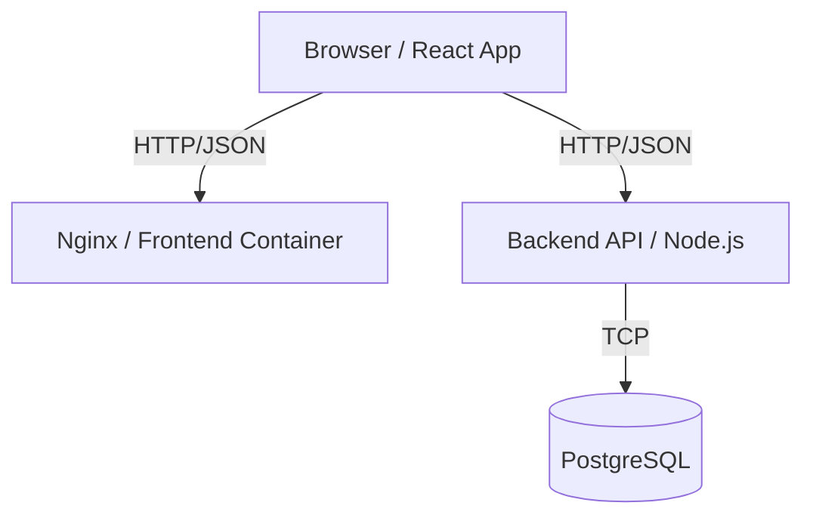

# Blog Starter Project

A production-ready starter project for a simple blog-style web app.

## Tech Stack

- **Frontend**: React + TypeScript + Vite + Tailwind CSS
- **Backend**: Node.js + TypeScript + Express
- **Database**: PostgreSQL with Prisma ORM
- **Infrastructure**: Docker & Docker Compose

## Architecture



## Prerequisites

- Docker
- Docker Compose

## Getting Started

1.  **Clone the repository**

2.  **Environment Setup**
    Copy `.env.example` to `.env` (optional, defaults provided in docker-compose).

3.  **Run with Docker Compose**
    ```bash
    docker-compose up --build
    ```
    This will start:
    - Frontend at [http://localhost:3000](http://localhost:3000)
    - Backend at [http://localhost:4000](http://localhost:4000)
    - Database (Postgres)

4.  **Initialize & Seed Database**
    First, push the schema to the database:
    ```bash
    docker-compose exec backend npx prisma db push
    ```

    Then, seed with initial users and posts:
    ```bash
    docker-compose exec backend npm run seed
    # Or using Makefile
    make seed
    ```

## Troubleshooting

### Windows & Google Drive
If you are running this project from a Google Drive folder (`G:\...`) on Windows, Docker volumes may fail to mount properly, causing "File not found" errors.

**Solution**:
1.  The `docker-compose.yml` has been updated to disable volume mounting by default to support this environment.
2.  **Note**: This means "Hot Reloading" (instant code updates) is disabled. You must re-run `docker-compose up --build` to see code changes.
3.  For the best development experience (with Hot Reload), move the project to a local drive (e.g., `C:\Work\blog-starter`) and uncomment the `volumes` sections in `docker-compose.yml`.

5.  **Access Data**
    - Login with: `alice@example.com` / `password123`

## Development

- **Backend**: Located in `/backend`. Edits will hot-reload (via nodemon).
- **Frontend**: Located in `/frontend`. Edits will hot-reload (via Vite).

## Commands

- `make up`: Start services
- `make down`: Stop services
- `make logs`: View logs
- `make test-backend`: Run backend tests

## Deployment

1.  Build images:
    ```bash
    docker build -t my-blog-backend ./backend
    docker build -t my-blog-frontend ./frontend
    ```
2.  Push to registry.
3.  Deploy using Kubernetes manifests or Docker Swarm (not included in this starter).

## API Endpoints

- `POST /api/auth/register`
- `POST /api/auth/login`
- `GET /api/posts`
- `GET /api/posts/:id`
- `POST /api/posts` (Auth required)
- `PUT /api/posts/:id` (Owner only)
- `DELETE /api/posts/:id` (Owner only)
